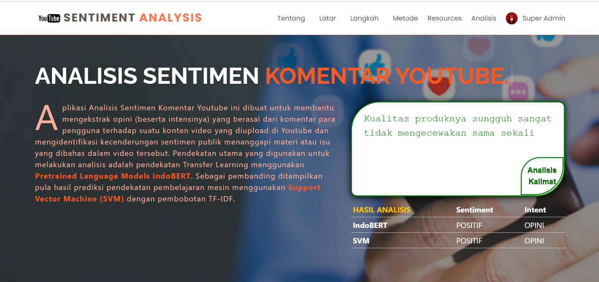
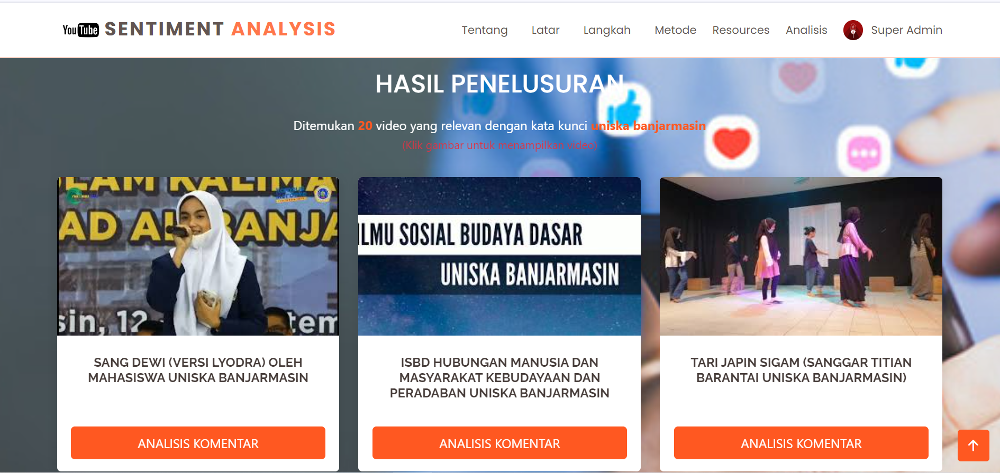
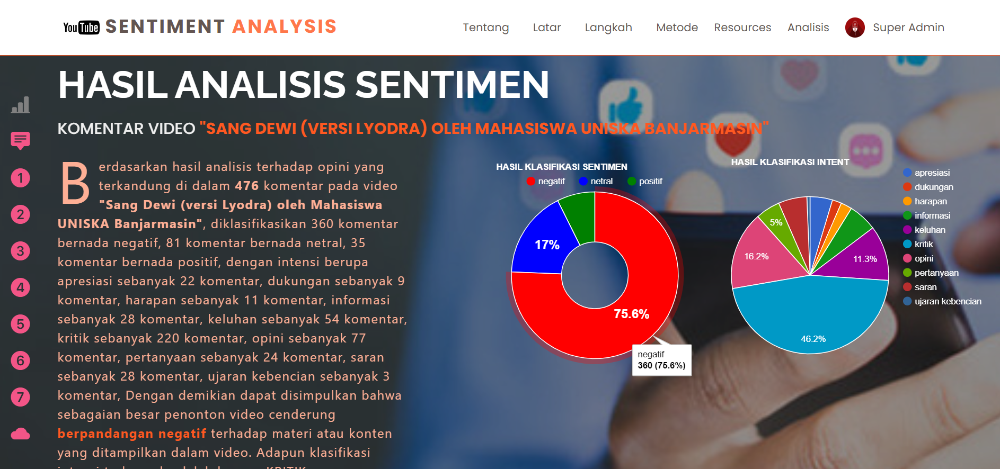

  <div align="center">
  <h1 align="center">Youtube Comment Sentiment Analysis</h1>
  <h3>FAHRURAJI - NPM. 19630940</h3>
  <h5>PROGRAM STUDI S1 TEKNIK INFORMATIKA FAKULTAS TEKNOLOGI INFORMASI<br/>
  UNIVERSITAS ISLAM KALIMANTAN MUHAMMAD ARSYAD AL BANJARI BANJARMASIN</h5>

  <p align="center">


  </p>
  </div>
  
  ---
  
  Aplikasi Analisis Sentimen Komentar Youtube ini dibuat untuk membantu mengekstrak opini yang berasal dari komentar para pengguna (viewer) terhadap suatu konten video yang diupload di Youtube dan mengidentifikasi kecenderungan sentimen publik (beserta intensi dari komentar) menanggapi materi atau isu yang dibahas dalam video tersebut. 
  
  Dibangun menggunakan bahasa pemrograman Python dengan microframework Flask, memanfaatkan teknik Natural Language Processing (NLP) untuk melakukan analisis sentimen dan deteksi niat (intensi) pada teks berbahasa Indonesia. Pendekatan utama yang digunakan untuk melakukan analisis adalah pendekatan Transfer Learning menggunakan <strong>Pretrained Language Models IndoBERT</strong>. Sebagai pembanding ditampilkan pula hasil prediksi pendekatan pembelajaran mesin menggunakan <strong>Support Vector Machine (SVM)</strong> dengan pembobotan TF-IDF.

---

## 📁 Struktur Project

```sh
YTSA
├── app
│   ├── controller
│   │   ├── AuthController.py
│   │   ├── HomeController.py
│   │   ├── MainController.py
│   │   ├── UserController.py
│   │   └── WordsController.py
│   ├── helpers
│   │   ├── classifying.py
│   │   ├── commons.py
│   │   ├── preprocessing.py
│   │   ├── scraping.py
│   │   └──visualizing.py
│   ├── ml
│   │   ├── indobert
│   │   │   ├── intent
│   │   │   └── sentiment
│   │   └── svm
│   │       ├── intent
│   │       └── sentiment
│   ├── model
│   │   ├── analysis.py
│   │   ├── comments.py
│   │   ├── compound.py
│   │   ├── corpus.py
│   │   ├── informal.py
│   │   ├── negasi.py
│   │   ├── negative.py
│   │   ├── positive.py
│   │   ├── preprocessed.py
│   │   ├── processed.py
│   │   ├── root.py
│   │   ├── stopword.py
│   │   ├── user.py
│   │   ├── youtube.py
│   │   └── __init__.py
│   ├── res
│   ├── response.py
│   ├── restriction.py
│   ├── routes
│   │   ├── auth.py
│   │   ├── main.py
│   │   ├── user.py
│   │   └── words.py
│   ├── static
│   │   ├── css
│   │   ├── img
│   │   ├── js
│   │   └── scss
│   ├── templates
│   │   ├── auth
│   │   │   ├── login.html
│   │   │   └── reset_passwd.html
│   │   ├── error_page
│   │   │   ├── forbidden.html
│   │   │   ├── internal_error.html
│   │   │   └── not_found.html
│   │   ├── home
│   │   │   ├── hero.html
│   │   │   ├── how.html
│   │   │   ├── index.html
│   │   │   ├── others.html
│   │   │   ├── what.html
│   │   │   └── why.html
│   │   ├── kosakata
│   │   │   ├── compound.html
│   │   │   ├── corpus.html
│   │   │   ├── formal.html
│   │   │   ├── negation.html
│   │   │   ├── negative.html
│   │   │   ├── positive.html
│   │   │   ├── root.html
│   │   │   └── stopword.html
│   │   ├── layout
│   │   │   ├── base.html
│   │   │   ├── footer.html
│   │   │   ├── header.html
│   │   │   ├── main-nav.html
│   │   │   └── nav.html
│   │   ├── mail
│   │   │   ├── activation.html
│   │   │   ├── invitation.html
│   │   │   └── verification.html
│   │   ├── main
│   │   │   ├── casefolded.html
│   │   │   ├── classified.html
│   │   │   ├── comments.html
│   │   │   ├── dist_freq.html
│   │   │   ├── filtered.html
│   │   │   ├── history.html
│   │   │   ├── index.html
│   │   │   ├── normalized.html
│   │   │   ├── search.html
│   │   │   ├── stemmed.html
│   │   │   ├── summary.html
│   │   │   ├── tokenized.html
│   │   │   ├── train_result.html
│   │   │   ├── vectorized.html
│   │   │   └── wordcloud.html
│   │   ├── print
│   │   │   └── table.html
│   │   ├── tes.html
│   │   └── user
│   │       ├── profile.html
│   │       └── users.html
│   ├── uploadconfig.py
│   ├── utils
│   │   ├── args_helper.py
│   │   ├── conlleval.py
│   │   ├── data_utils.py
│   │   ├── forward_fn.py
│   │   ├── functions.py
│   │   └── metrics.py
│   └── __init__.py
├── .env
├── config.py
├── init.py
├── requirements.txt
└── server.py
```
Proyek ini mencakup berbagai file dan direktori, masing-masing dengan tujuan spesifiknya sendiri:* `app`: Berisi aplikasi Flask utama dan rute, template, dan aset statis terkait.* `ml`: Berisi model pembelajaran mesin untuk analisis sentimen dan klasifikasi, termasuk model IndoBERT dan model Support Vector Machine (SVM) untuk analisis sentimen dan deteksi niat .* `model`: Berisi kelas-kelas yang mewakili struktur database.* `res`: Berisi berkas csv hasil impor.* `routes`: Berisi definisi rute untuk aplikasi Flask.* `static`: Berisi aset statis seperti gambar, stylesheet CSS dan file JavaScript.* `templates`: Berisi template HTML untuk Aplikasi Flask.* `utils`: Berisi fungsi utilitas untuk prapemrosesan dan analisis data.* `config.py`: Berisi pengaturan konfigurasi untuk aplikasi Flask.* `init.py`: Menginisialisasi aplikasi Flask.* `requirements.txt` : Berisi dependensi untuk proyek.* `server.py`: Merupakan titik masuk utama aplikasi.


<details><summary>\</summary>

| File | Fungsi |
| ---- | ------- |
| config.py |  Mendefinisikan kelas Config yang menetapkan berbagai variabel konfigurasi untuk suatu aplikasi, termasuk kredensial database, JWT secret key, security salt, dan pengaturan server email. |
| init.py |  Menginisialisasi aplikasi untuk pertama kali. |
| server.py |  Mendefinisikan aplikasi Flask dengan berbagai rute, cetak biru, dan fungsi untuk menangani otentikasi pengguna, penanganan kesalahan, dan impor/ekspor data. Fungsi utama kode ini adalah menyediakan antarmuka berbasis web untuk mengelola data dalam database, termasuk mengimpor dan mengekspor data dalam format CSV, serta melakukan berbagai operasi pada data seperti klasifikasi teks dan analisis sentimen. |

</details>

---

<details><summary>\app</summary>

| File | Fungsi |
| ---- | ------- |
| response.py |  Mendefinisikan dua fungsi, `success` dan `badRequest`, yang mengembalikan respons JSON dengan nilai dan pesan yang ditentukan, dengan `success` mengembalikan kode status 200 dan `badRequest` mengembalikan kode status 400. |
| restriction.py |  Mendefinisikan fungsi dekorator `permission_required` yang membatasi akses ke tampilan untuk pengguna dengan izin admin, dan fungsi `admin_required` yang menerapkan dekorator `permission_required` ke tampilan. |
| uploadconfig.py |  Mendefinisikan fungsi untuk memeriksa apakah file yang diunggah memiliki ekstensi yang diizinkan, yaitu png jpg dan jpeg. |
| __init__.py |  Mendefinisikan aplikasi Flask dan komponen database, migrasi, perlindungan CSRF, manajemen login, dan pengiriman email. |

</details>

---

<details><summary>\app\controller</summary>

| File | Fungsi |
| ---- | ------- |
| AuthController.py |  Menyediakan fungsi otentikasi dan otorisasi bagi pengguna, mencakup fitur login, logout, aktivasi, reset kata sandi, dan pengiriman OTP (One-Time Password). |
| HomeController.py | Berisi fungsi untuk merender beranda aplikasi dan fungsi classify yang mengambil kalimat dari input pengguna, memprosesnya menggunakan model SVM dan IndoBERT untuk mengklasifikasikan sentimen dan maksud kalimat. Hasilnya kemudian disimpan dalam variabel sesi dan ditampilkan ke halaman beranda. |
| MainController.py |  Berisi fungsi untuk menganalisis sentimen dan maksud di balik komentar video YouTube. |
| UserController.py |  Mendefinisikan beberapa fungsi terkait manajemen pengguna, termasuk mendaftarkan pengguna baru, membuat pengguna baru, memperbarui profil pengguna, mengunggah gambar pengguna, mengubah kata sandi pengguna, mengelola peran dan izin pengguna, dan menghapus pengguna. |
| WordsController.py |  Mendefinisikan beberapa fungsi untuk mengelola resources seperti akar kata, kata berimbuhan, stopword dan lain-lain. |

</details>

---

<details><summary>\app\helpers</summary>

| File | Fungsi |
| ---- | ------- |
| classifying.py |  Mendefinisikan kelas-kelas untuk melakukan pelatihan model dan analisis sentimen menggunakan algoritma Support Vector Machine (SVM) dan IndoBERT. |
| commons.py |  Mendefinisikan sejumlah fungsi dan kelas untuk melakukan paginasi, pengiriman email, dan pengambilan data dari database menggunakan SQLAlchemy. |
| preprocessing.py |  Mendefinisikan serangkaian fungsi untuk prapemrosesan teks, termasuk pembersihan, tokenisasi, normalisasi, stemming, penanganan negasi, dan pemfilteran. Fungsi utama kode ini adalah menyiapkan data teks untuk analisis lebih lanjut dalam tugas pemrosesan bahasa alami. |
| scraping.py |  Mendefinisikan fungsi untuk melakukan pengambilan informasi dan data komentar menggunakan API YouTube. |
| visualizing.py | Mendefinisikan fungsi untuk menggenerate awan kata. |

</details>

---

<details><summary>\app\model</summary>

| File | Fungsi |
| ---- | ------- |
| analysis.py |  Mendefinisikan struktur tabel untuk menyimpan riwayat analisis yang dilakukan pengguna. |
| comments.py |  Mendefinisikan struktur tabel untuk menyimpan komentar video Youtube hasil proses scraping. |
| compound.py |  Mendefinisikan struktur tabel untuk menyimpan data kata berimbuhan. |
| corpus.py |  Mendefinisikan struktur tabel untuk menyimpan data korpus yang akan digunakan untuk pelatihan model. |
| informal.py |  Mendefinisikan struktur tabel untuk menyimpan data kata informal. |
| negasi.py |  Mendefinisikan struktur tabel untuk menyimpan data kata negasi. |
| negative.py |  Mendefinisikan struktur tabel untuk menyimpan data kata yang mengandung sentimen negatif. |
| positive.py |  Mendefinisikan struktur tabel untuk menyimpan data kata yang mengandung sentimen positif. |
| preprocessed.py |  Mendefinisikan struktur tabel untuk menyimpan data hasil preprocessing. |
| processed.py |  Mendefinisikan struktur tabel untuk menyimpan data hasil klasifikasi. |
| root.py |  Mendefinisikan struktur tabel untuk menyimpan data akar kata. |
| stopword.py |  Mendefinisikan struktur tabel untuk menyimpan data stopword. |
| user.py |  Mendefinisikan struktur tabel untuk menyimpan data pengguna. |
| youtube.py |  Mendefinisikan struktur tabel untuk menyimpan informasi video Youtube. |
| __init__.py |  Berguna untuk mengatur model-model atau kelas-kelas yang digunakan dalam aplikasi. |

</details>

---


<details><summary>\app\routes</summary>

| File | Fungsi |
| ---- | ------- |
| auth.py |  Mendefinisikan Flask Blueprint untuk mengelompokkan dekorator yang digunakan untuk memetakan URL ke fungsi otentikasi dan otorisasi pengguna. |
| main.py |  Mendefinisikan Flask Blueprint untuk mengelompokkan dekorator yang digunakan untuk memetakan URL ke fungsi analisis. |
| user.py |  Mendefinisikan Flask Blueprint untuk mengelompokkan dekorator yang digunakan untuk memetakan URL ke fungsi manajemen pengguna. |
| words.py |  Mendefinisikan Flask Blueprint untuk mengelompokkan dekorator yang digunakan untuk memetakan URL ke fungsi pengelolaan resources. |

</details>

---

<details><summary>\app\utils</summary>

| File | Fungsi |
| ---- | ------- |
| args_helper.py |  Mendefinisikan berbagai fungsi dan kelas yang terkait dengan pemuatan data, prapemrosesan, dan evaluasi untuk tugas pemrosesan bahasa alami. |
| conlleval.py |  Merupakan implementasi Python dari skrip evaluasi tugas bersama CoNLL-2000, yang mengevaluasi keakuratan model pengenalan entitas bernama (NER) pada kumpulan data tertentu. Fungsi utama kode ini adalah menghitung metrik tingkat keseluruhan dan tipe untuk model NER, termasuk presisi, perolehan, dan skor F1, serta rata-rata makro presisi, perolehan, dan skor F1 untuk setiap jenis entitas. |
| data_utils.py |  Mendefinisikan beberapa kelas yang digunakan pada PyTorch untuk memuat dan melakukan praproses data untuk melatih model pembelajaran mesin. Kelas-kelas tersebut dirancang untuk bekerja dengan berbagai jenis kumpulan data, termasuk klasifikasi teks, analisis sentimen, dan analisis sentimen berbasis aspek. Kelas `AspectExtractionDataset` memuat kumpulan data teks dengan anotasi sentimen tingkat aspek dan mengembalikan tupel subkata, urutan label, dan kalimat aslinya. Kelas `NerGritDataset` memuat kumpulan data entitas bernama dan mengembalikan tupel subkata, label urutan, dan kalimat asli. Kelas `PosTagIdnDataset` memuat kumpulan data tag part-of-speech dan mengembalikan serangkaian subkata, label urutan, dan kalimat asli. Kelas `EmotionDetectionDataset` memuat kumpulan data emosi dan mengembalikan serangkaian subkata, label urutan, dan kalimat asli. Kelas `EntailmentDataset` memuat kumpulan data yang diperlukan dan mengembalikan tupel subkata, label urutan, dan kalimat asli. Kelas `DocumentSentimentDataset` memuat kumpulan data sentimen dokumen dan mengembalikan tupel subkata, label urutan, dan kalimat asli. Kelas `KeywordExtractionDataset` memuat kumpulan data ekstraksi kata kunci dan mengembalikan tupel subkata, label urutan, dan kalimat asli. |
| forward_fn.py |  Mendefinisikan forward functions untuk klasifikasi urutan, klasifikasi kata, dan klasifikasi multilabel urutan. Setiap fungsi mengambil sekumpulan data, menyiapkan masukan dan label, lalu meneruskan data melalui model untuk menghasilkan prediksi dan menghitung kerugian. Fungsinya juga menangani kasus dimana data masukan ada pada GPU. |
| functions.py |  Mendefinisikan berbagai fungsi dan kelas yang terkait dengan tugas pemrosesan bahasa alami (NLP), seperti klasifikasi urutan, klasifikasi token, dan klasifikasi multi-label. |
| metrics.py |  Mendefinisikan serangkaian fungsi untuk menghitung berbagai metrik untuk tugas pemrosesan bahasa alami, termasuk deteksi emosi, ekstraksi aspek, pengenalan entitas bernama, penandaan bagian ucapan, keterlibatan, sentimen dokumen, ekstraksi kata kunci, menjawab pertanyaan, dan kategorisasi berita. Setiap fungsi memerlukan dua argumen: daftar label yang diprediksi dan daftar label yang sebenarnya, serta menampilkan kamus metrik. |

</details>

---


## 🚀 Langkah Instalasi

1. Sebelum memulai instalasi, pastikan Python versi 3.7 ke atas sudah dipasang dan bisa diakses menggunakan terminal.
2. Aktifkan server MySQL, buat database baru dan sesuaikan informasi HOST, USER, PASSWORD, dan NAMA DATABASE pada file .env
3. Buat lingkungan virtual dengan mengetik pada terminal `python -m venv env` 
4. Aktifkan lingkungan virtual dengan mengetik `env\Scripts\activate` (untuk windows) atau `source env/bin/activate` (untuk linux atau macOS)
5. Pasang seluruh dependensi dengan mengetik `pip install -r requirements.txt`, jika Anda menggunakan VGA NVIDIA yang mendukung CUDA lanjutkan ketik `pip install -r requirements2.txt`
6. Lakukan pemasangan aplikasi dengan mengetik `python init.py`
7. Jalankan server flask dengan mengetik `flask run`
8. Buka browser dan arahkan ke url [http://localhost:5000/login](http://localhost:5000/login)
9. Login sebagai superadmin menggunakan username `admin@mail.com` dan password `53cr3tK3y`
10. Struktur menu aplikasi:
```sh
    BERANDA
    ├── Tentang
    ├── Latar
    ├── Langkah
    ├── Metode
    ├── Resources
    │   ├── Akar Kata
    │   ├── Kata Berimbuhan
    │   ├── Kata Informal
    │   ├── Kata Negasi
    │   ├── Stopword
    │   ├── Kata Positif
    │   └── Kata Negatif
    ├── Analisis
    │   ├── Analisis Komentar Youtube
    │   │   └── Hasil Analisis Komentar Video
    │   │       ├── Ringkasan
    │   │       ├── Sebaran Sentimen
    │   │       ├── Hasil Scraping
    │   │       ├── Hasil Casefolding
    │   │       ├── Hasil Tokenisasi
    │   │       ├── Hasil Normalisasi
    │   │       ├── Hasil Stemming
    │   │       ├── Hasil Filtering
    │   │       ├── Hasil Vektorisasi
    │   │       ├── Hasil Klasifikasi
    │   │       └── Awan Kata
    │   ├── Pelatihan Model Analisis
    │   ├── Hasil Pelatihan Sentimen
    │   ├── Hasil Pelatihan Inten
    └── Login
        ├── User
        │   ├── Profil
        │   └── Logout
        └── Admin
            ├── Kelola Pengguna
            ├── Profil
            └── Logout
```

---
## 📸 Screenshot

Home Screen

Search Screen

Search Result

Analysis Result

Wordcloud